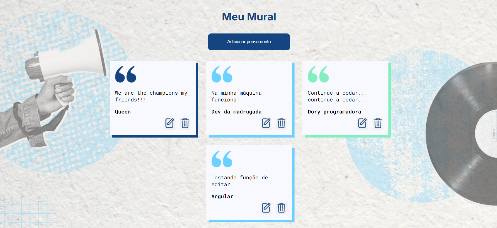

# # CRUD de Cards - Guarde Trechos e Citações

This project was generated with [Angular CLI](https://github.com/angular/angular-cli) version 14.0.3.

Este projeto é uma aplicação de CRUD (Criar, Ler, Atualizar e Deletar) que permite aos usuários guardar e gerenciar trechos de músicas, citações de livros, pensamentos e suas melhores ideias. A interface é intuitiva e fácil de usar, proporcionando uma experiência agradável ao usuário.

## Funcionalidades

- **Adicionar Card**: Permite que o usuário adicione novos trechos ou citações.
- **Visualizar Cards**: Mostra todos os cards adicionados em uma interface organizada.
- **Editar Card**: Permite que o usuário edite um card existente.
- **Deletar Card**: Possibilita a remoção de cards indesejados.
- **Busca e Filtros**: Funcionalidade de busca para encontrar rapidamente trechos específicos.

## Tecnologias Utilizadas

- **Frontend**: [Angular/React/Vue]
- **Backend**: [json-server/Node.js]
- **CSS**: Estilização responsiva e moderna.

## Instalação

### Clone o Repositório

bash
git clone https://github.com/AndressaTurchetto/crud-cards.git

bash
cd nome-do-repositorio

Instale as Dependências
npm install

Executando o Backend
Se você estiver usando o json-server para simular a API, navegue até a pasta do backend e execute:
cd backend
json-server --watch db.json

Navegue de volta à pasta do frontend e inicie a aplicação:
ng serve
Acesse a aplicação no seu navegador em http://localhost:4200.

