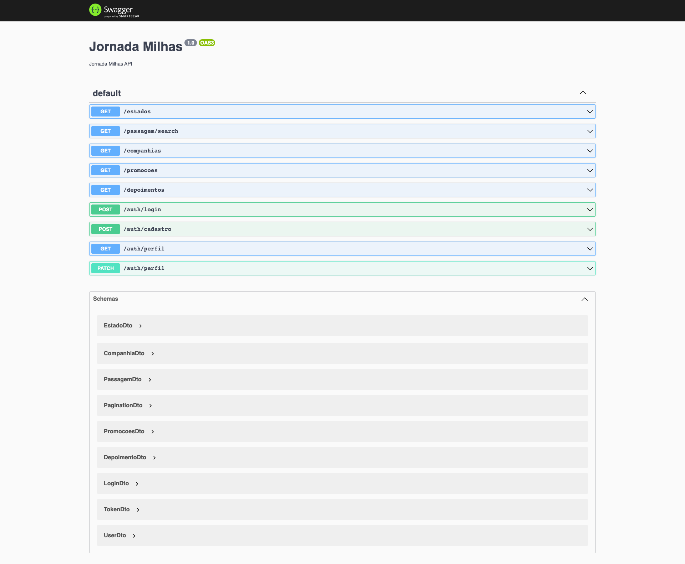
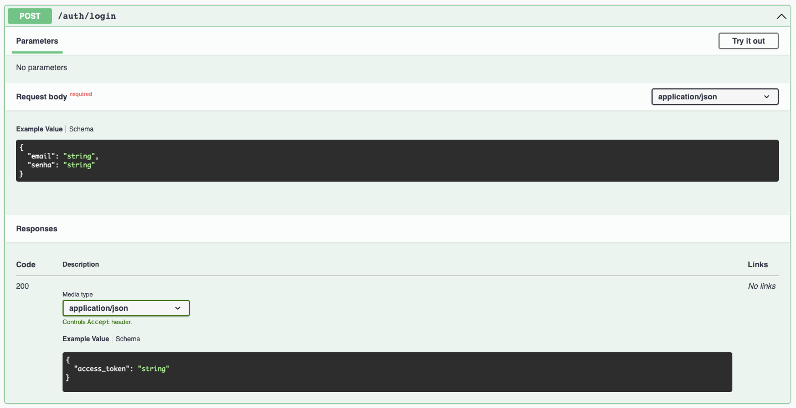

# Viaja NET

O Viaja NET é uma startup fictícia para fins didáticos. 

# Api em Nest

Esse é um protótipo da API pra permitir o desenvolvimento do frontend.

## 🛠️ Instalação

```bash
$ git clone https://github.com/AndressaTurchetto/viajaNetApi.git 
``` 

```bash
$ npm install
```

## 🛠️ Execução

Abra um terminal e execute o seguinte comando:

```bash
$ npm run start
```

## 🛠️ Documentação

Com a aplicação em execução, abra o seu navegador e acesse [http://localhost:8080/api](http://localhost:8080/api) para ter acesso ao Swagger, a fonte de verdade sobre a nossa API e como ela funciona:




## Autenticação

Você pode se cadastrar utilizando o endpoint:


E se autenticar utilizando o endpoint:



E depois, basta adicionar o token ao header das requisições autenticadas:

```
Authorization: Bearer <ACCESS_TOKEN>
```
