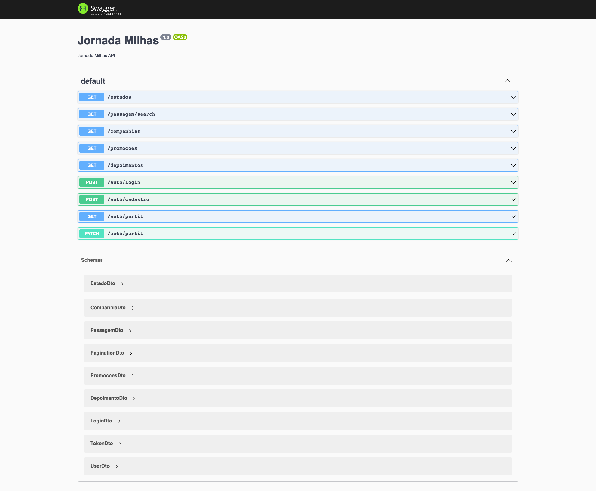

# Travel Online

The is a fictitious StartUP. On the website we can search for flight tickets and even filter your results by prices, connections and companies. It also has registration, login and profile editing features.



# Api in Nest

This is an API prototype to allow frontend development.

## 🛠️ Run the project

```bash
$ git clone https://github.com/AndressaTurchetto/viajaNetApi.git 
``` 

```bash
$ npm install
```

## 🛠️ Execution

Open a terminal and run the following command:

```bash
$ npm run start
```

## 🛠️ Documentation

With the application running, open your browser and access [http://localhost:8080/api](http://localhost:8080/api) to access Swagger, the source of truth about our API and how it works:


## Authentication

You can register using the endpoint:


And authenticate using the endpoint:


And then, just add the token to the header of authenticated requests:

```
Authorization: Bearer <ACCESS_TOKEN>
```
